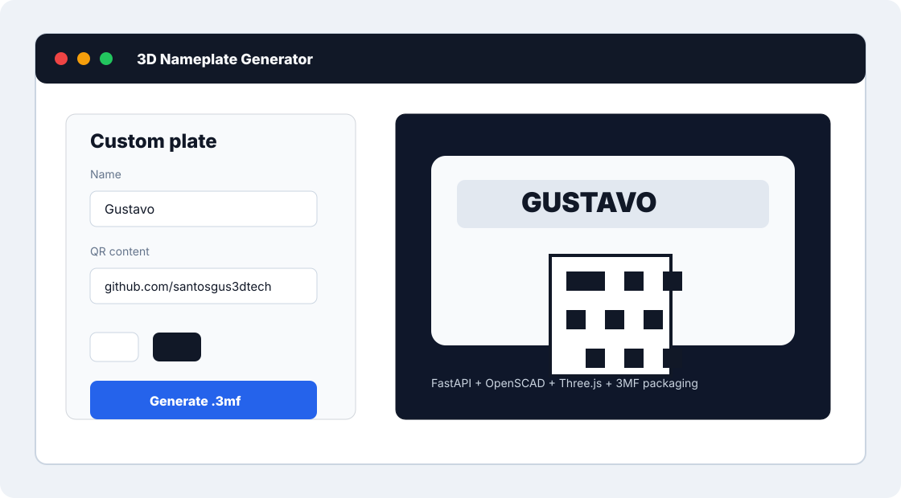

# 3D Nameplate Generator

FastAPI web app for generating personalized 3D nameplates with real QR codes, a Three.js preview and `.3mf` export for multicolor workflows in slicers such as Bambu Studio and OrcaSlicer.



## What It Shows

- Python/FastAPI backend returning generated files on demand.
- Parametric geometry generation with OpenSCAD.
- QR codes converted into real 3D blocks with `segno`.
- Manual `.3mf` package assembly with separated parts and colors.
- Interactive 3D preview built with Three.js.
- A small, practical customization workflow for real 3D-printing use.

## Stack

- Python, FastAPI, Uvicorn, Jinja2
- OpenSCAD
- segno, trimesh, numpy
- HTML, CSS, JavaScript, Three.js

## Running Locally

Install OpenSCAD and, if it is outside the default Windows path, set:

```powershell
$env:OPENSCAD_PATH = "C:\Program Files\OpenSCAD\openscad.exe"
```

Then:

```bash
python -m venv .venv
.venv\Scripts\activate
python -m pip install -r requirements.txt
python -m uvicorn app:app --reload
```

Open `http://127.0.0.1:8000`.

## Structure

```text
app.py              # Web routes and .3mf download
gerador_3mf.py      # Temporary STL generation and .3mf package assembly
modelo_base.scad    # Base parametrica
modelo_nome.scad    # Texto em relevo
static/             # Preview 3D e estilos
templates/          # Tela principal
```

`saida_3mf/` and `temp/` are generated at runtime and stay out of Git.

## Portfolio

This project is a strong portfolio piece because it combines backend work, 3D geometry, technical file packaging and an interactive UI in a small, clear and demonstrable product. The repository also includes a GitHub Actions test workflow for core geometry/file-safety helpers. See [docs/portfolio-case-study.md](docs/portfolio-case-study.md).
